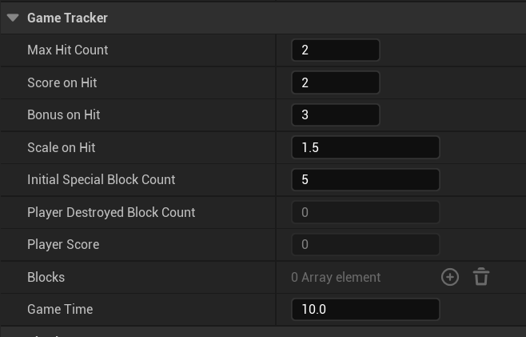

# Week2 作业笔记

## 功能
1. 命中方块后玩家得分, 子弹被销毁, 方块缩放
2. 命中特殊方块(红色), 获得额外的分数
3. 以下参数可自定义:
    - 玩家击中方块后的得分 `ScoreOnHit` (击中特殊方块可以获得额外加分 `BonusOnHit`, 默认和 `ScoreOnHit` 相同)
    - 摧毁方块所需的击中次数 `MaxHitCount`, 默认为 2
    - 击中方块后的缩放比例 `ScaleOnHit`, 默认为 2
    - 游戏开始时特殊方块的数量 `InitialSpecialBlockCount`, 默认为 5. 大于等于方块数时每一个方块都是特殊方块
    - 游戏时长 `GameTime`, 默认 10s
4. 单人游戏
5. 游戏时长用尽后游戏结束, log 中打印玩家得分

## 相关源码
- `Source/Block.h & .cpp`
- `Source/GameTracker.h & .cpp`
- `Source/Week2Projectile.h & .cpp`

## 修改 `AWeek2Projectile`

`AWeek2Projectile::OnHit` 中, 在摧毁子弹前, 添加:

``` c++
if (auto* Block = Cast<ABlock>(OtherActor)) {
  Block->OnHit();
}
```

## 游戏规则和得分 `AGameTracker`

在 Tracker 中放置游戏参数, 并在世界里放置唯一实例. 游戏规则可以从该实例的 Details 面板修改.



``` c++
  UFUNCTION(BlueprintCallable)
  void UpdateScore(bool IsBlockSpecial);

  UPROPERTY(EditAnywhere, BlueprintReadWrite)
  uint8 MaxHitCount{2};

  UPROPERTY(EditAnywhere, BlueprintReadWrite)
  uint8 ScoreOnHit{2};

  UPROPERTY(EditAnywhere, BlueprintReadWrite)
  uint8 BonusOnHit{2};

  UPROPERTY(EditAnywhere, BlueprintReadWrite)
  float ScaleOnHit{2.f};

  UPROPERTY(EditAnywhere, BlueprintReadWrite)
  int32 InitialSpecialBlockCount{5};

  UPROPERTY(VisibleAnywhere, BlueprintReadWrite)
  int32 PlayerDestroyedBlockCount{};

  UPROPERTY(VisibleAnywhere, BlueprintReadWrite)
  int32 PlayerScore{};

  UPROPERTY(VisibleAnywhere, BlueprintReadOnly)
  TArray<AActor*> Blocks;

  UPROPERTY(EditAnywhere, BlueprintReadWrite)
  float GameTime = 10.f;
```

根据被击中方块是否为特殊方块更新得分:

``` c++
void AGameTracker::UpdateScore(bool IsBlockSpecial) {
  ++PlayerDestroyedBlockCount;

  PlayerScore += ScoreOnHit;
  if (IsBlockSpecial) {
    PlayerScore += BonusOnHit;
  }
}
```

游戏开始时, Tracker 记录游戏中所有的方块. 随机选择 `InitialSpecialBlockCount` 个方块成为特殊方块, 标记为红色. 这可以在遍历所有方块的时候顺便完成. 具体地, 采用 selection sampling, 在遍历方块的过程中, 每个方块有 `p` 的概率被选中成为特殊方块, 其中 `p = 还需要多少特殊方块 / 还剩下多少方块没有遍历`. 采用这一方法会产生的特殊方块数正好满足要求, 且每个方块成为特殊方块的概率相同.

``` c++
void AGameTracker::BeginPlay() {
  Super::BeginPlay();

  UGameplayStatics::GetAllActorsWithTag(GetWorld(), FName{"Block"}, Blocks);


  int32 RemainBlockCount = Blocks.Num();
  int32 RemainSpecialCount = std::min(InitialSpecialBlockCount, RemainBlockCount);
  for (auto& Actor : Blocks) {
    if (auto* Block = Cast<ABlock>(Actor)) {
      Block->OnBlockHit.AddDynamic(this, &AGameTracker::UpdateScore);

      // Randomly make some blocks special (selection sampling)
      float Prob = static_cast<float>(RemainSpecialCount) / RemainBlockCount;
      if (auto R = FMath::FRandRange(0.f, 1.f); R < Prob) {
        Block->MakeSpecial();
        --RemainSpecialCount;
      }
      
      --RemainBlockCount;
    }
  }
}

void ABlock::MakeSpecial() {
  IsSpecial = true;
  if (auto* StaticMesh = Cast<UStaticMeshComponent>(GetRootComponent())) {
    if (auto* Mat = StaticMesh->CreateAndSetMaterialInstanceDynamic(0)) {
      Mat->SetVectorParameterValue(TEXT("Base Color"), FLinearColor::Red);
    }
  }
}
```

## 可摧毁的方块类 `ABlock`

### 击中时放大

Block 头文件中, 添加击中时的 delegate:

``` c++
DECLARE_DYNAMIC_MULTICAST_DELEGATE_OneParam(FOnBlockHit, bool, IsSpecial);

class ABlock : public AActor {
  void OnHit();

  UPROPERTY(VisibleAnywhere, BlueprintReadOnly)
  uint8 HitCount{};

  UPROPERTY(VisibleAnywhere, BlueprintReadWrite)
  uint8 MaxHitCount{2};

  UPROPERTY(EditAnywhere, BlueprintReadWrite)
  float ScaleOnHit{1.5f};

  FOnBlockHit OnBlockHit;
};
```

`ABlock::BeginPlay` 中, 从 Tracker 获取游戏规则:

``` c++
  if (auto* Tracker = Cast<AGameTracker>(UGameplayStatics::GetActorOfClass(GetWorld(), AGameTracker::StaticClass()))) {
    MaxHitCount = Tracker->MaxHitCount;
    ScaleOnHit = Tracker->ScaleOnHit;
  } 
```

`ABlock::OnHit` 函数中处理被击中时的逻辑

``` c++
void ABlock::OnHit() {
  ++HitCount;
  OnBlockHit.Broadcast(IsSpecial);

  // 到达最大命中次数后销毁
  if (HitCount >= MaxHitCount) {
    OnBlockDestroyed.Broadcast(IsSpecial);
    Destroy();
    return;
  }

  ScaleTimeline.PlayFromStart();
}
```

### 缩放动画

被击中时我们希望得到平滑的缩放过渡效果, 这可以通过 timeline 实现. `ABlock` 类中添加:

``` c++
UPROPERTY(EditAnywhere)
UCurveFloat* ScaleCurve{};

FTimeline ScaleTimeline{};

UFUNCTION()
void TimelineUpdate(float Progress);

UFUNCTION()
void UpdateScaleRange();

float ScaleFrom{};

float ScaleTo{};
```

`ABlock::BeginPlay` 中:

``` c++
if (ScaleCurve) {
  ScaleTimeline.SetLooping(false);

  // 播放更新时调用 TimelineUpdate
  FOnTimelineFloat OnTimelineFloat{};
  OnTimelineFloat.BindUFunction(this, FName{"TimelineUpdate"});
  ScaleTimeline.AddInterpFloat(ScaleCurve, OnTimelineFloat);

  // 播放结束时调用 UpdateScaleRange
  FOnTimelineEvent OnTimelineEvent{};
  OnTimelineEvent.BindUFunction(this, FName{"UpdateScaleRange"});
  ScaleTimeline.SetTimelineFinishedFunc(OnTimelineEvent);
}

UpdateScaleRange();
```

播放的更新与结束:

``` c++
void ABlock::TimelineUpdate(float Progress) {
  using UE::Math::TVector2;
  float Scale = FMath::GetMappedRangeValueClamped(TVector2{0.f, 1.f}, TVector2{ScaleFrom, ScaleTo},
                                               Progress);
  SetActorScale3D({Scale, Scale, Scale});
}

void ABlock::UpdateScaleRange() {
  ScaleFrom = GetActorScale3D().GetMin();
  ScaleTo = ScaleFrom * ScaleOnHit;
}
```

