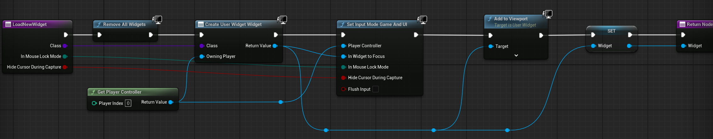

# Week 4 作业笔记

## 实现功能

- 血条显示, 被子弹击中生命减少, 血条更新
- 子弹数显示, 子弹用尽后无法继续开火
- 准星
- 子弹击中物体, 准星变为命中提示

## 主要实现细节

`Week4WeaponComponent` 中添加弹药数.

```cpp
UPROPERTY(BlueprintReadWrite)
int32 RemainingAmmo;

UPROPERTY(BlueprintReadWrite)
int32 MaxAmmo = 30;

void UWeek4WeaponComponent::BeginPlay() {
  Super::BeginPlay();

  RemainingAmmo = MaxAmmo;
}


void UWeek4WeaponComponent::Fire() {
  // ...
  
  RemainingAmmo = FMath::Clamp(RemainingAmmo - 1, 0, MaxAmmo);

  // ...
}
```

同理, `AWeek4Character` 中添加 `bHasWeapon`.


登录界面:


加载界面:


游戏界面:


当方块被击中, 显示命中指示, 变红, 1s 后销毁:


加载和切换 UI:


